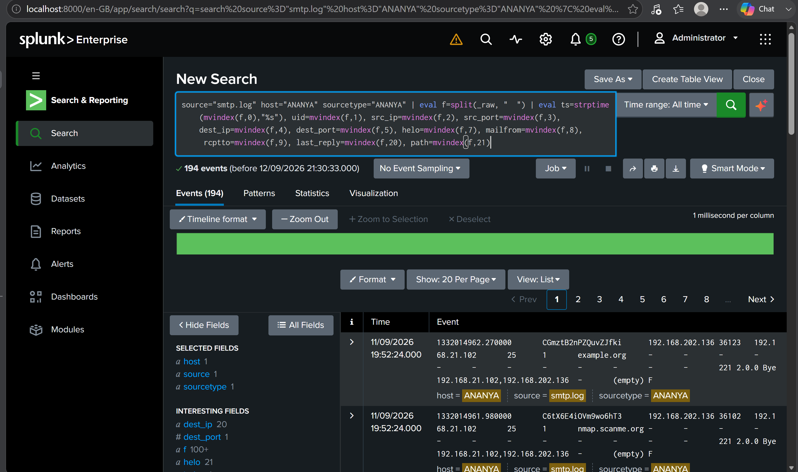
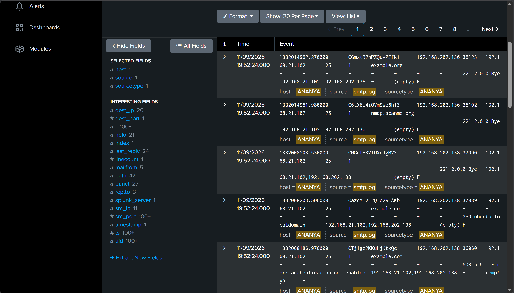
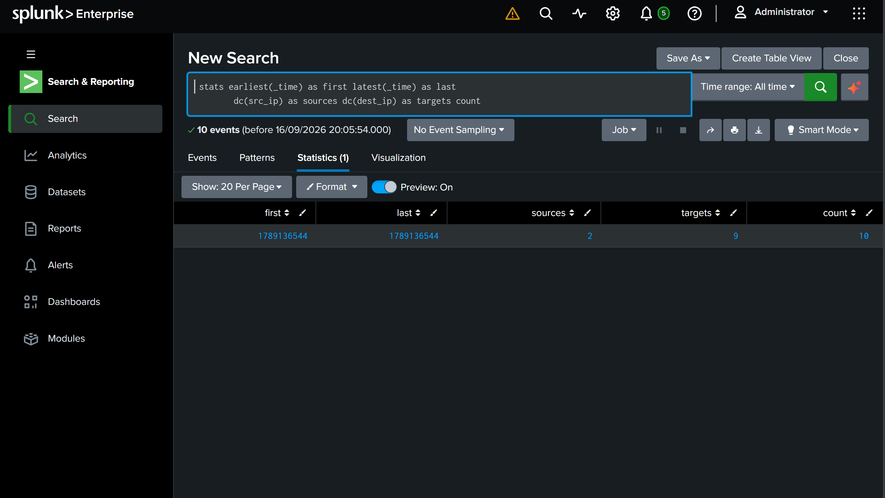
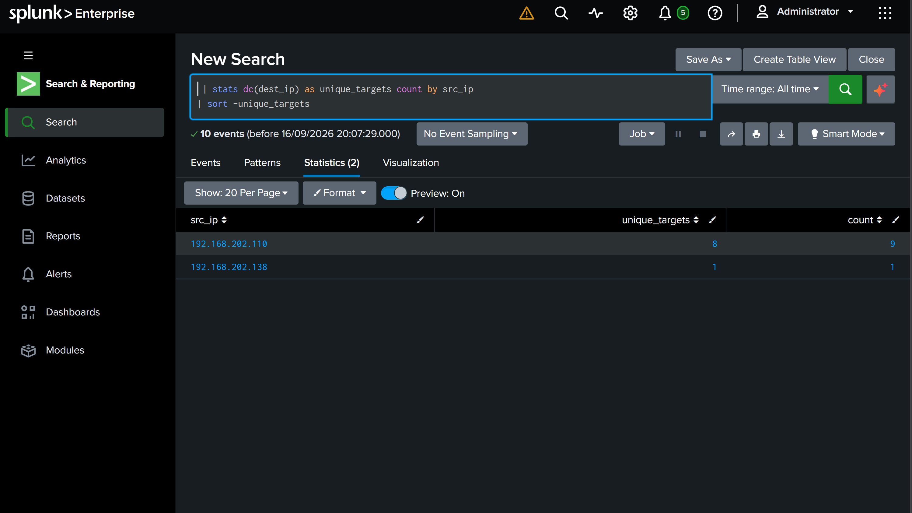
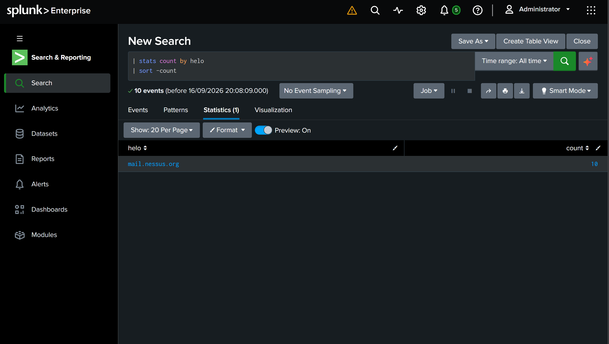
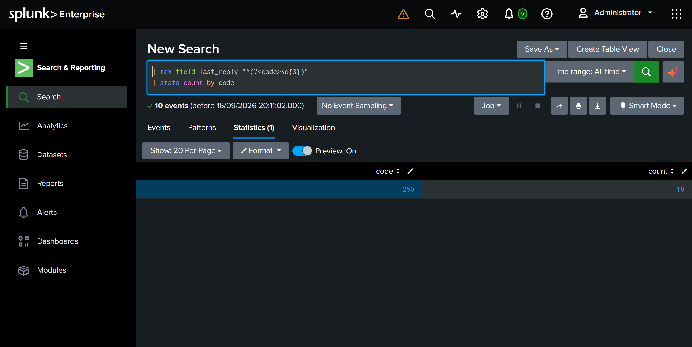
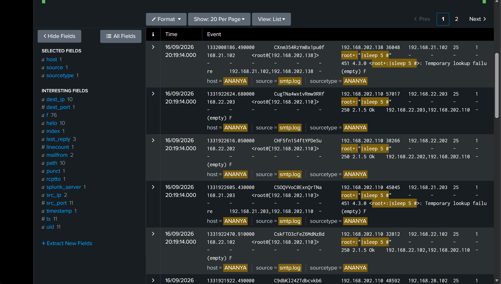
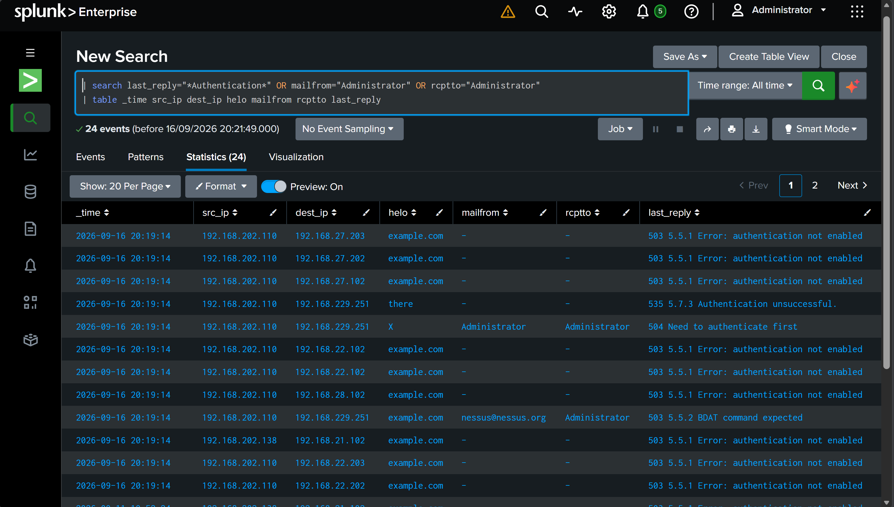
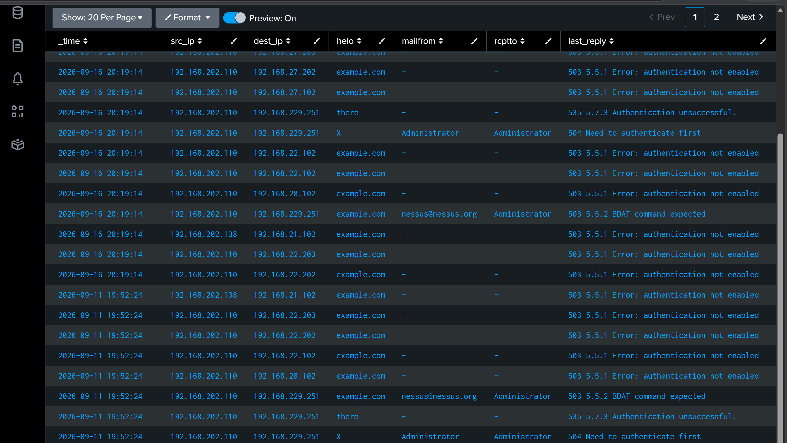
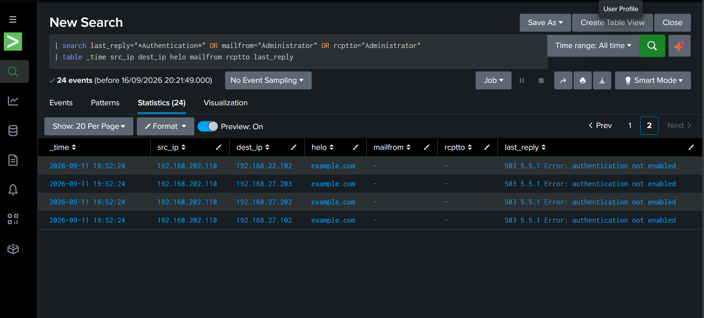

# SMTP Log Investigation — Zeek/Bro → Splunk

**Detecting SMTP reconnaissance, scanner fingerprinting, and a command-injection attempt in network mail traffic.**


---

## Table of Contents

1. [Executive Summary](#1-executive-summary)
2. [Why This Log Matters](#2-why-this-log-matters)
3. [Environment & Dataset](#3-environment--dataset)
4. [Field Extraction — Making Raw Zeek Readable in Splunk](#4-field-extraction--making-raw-zeek-readable-in-splunk)
5. [Investigation Workflow](#5-investigation-workflow)
6. [Key Findings](#6-key-findings)
7. [Indicators of Compromise](#7-indicators-of-compromise)
8. [MITRE ATT&CK Mapping](#8-mitre-attck-mapping)
9. [Recommendations](#9-recommendations)
10. [Repository Structure](#10-repository-structure)
11. [Skills Demonstrated](#11-skills-demonstrated)
12. [Notes, Caveats & Next Steps](#12-notes-caveats--next-steps)

---

## 1. Executive Summary

Over a **31-hour window (16 Mar 2012 12:47 UTC → 17 Mar 2012 20:09 UTC)**, **194 SMTP sessions** were captured by Zeek across **11 internal source hosts** and **20 destination mail servers** on port 25.

This was not normal mail traffic. A normal mail client talks to exactly one mail server. Here, single hosts were touching nine to fifteen servers each.

Three distinct behaviours were confirmed in the data:

| Phase | What happened | Evidence |
|---|---|---|
| **Reconnaissance** | Broad port-25 sweep across 20 mail servers | Fan-out of 9–15 destinations per source |
| **Fingerprinting** | Nmap and Nessus identified by their default HELO strings | `nmap.scanme.org` (31), `nessus` / `mail.nessus.org` (21) |
| **Exploitation attempt** | Shell command injected into the `RCPT TO` field | 11 attempts containing `root+:"\|sleep 5 #"` |

**The critical finding:** of the 11 command-injection attempts, **8 were answered with `250 Ok`**. The receiving mail servers accepted a recipient address containing a shell metacharacter and a pipe instead of rejecting it as malformed. Even though `sleep 5` is a harmless probe, the acceptance means the input-validation weakness the attacker was testing for is genuinely present.

---

## 2. Why This Log Matters

SMTP is one of the oldest protocols still in daily production use, and it is chatty by design. Every session leaves behind a full transcript of who introduced themselves as whom, who they claimed to be mailing from, who they were mailing to, and exactly how the server replied.

That transcript is a gift to a defender. Scanners rarely bother to hide in it. A `HELO` string is a courtesy field nobody validates, so tool authors leave defaults in place and operators never change them. A `RCPT TO` field is supposed to hold an email address, so anything in it that is *not* an email address is, by definition, worth looking at.

This investigation is a demonstration of that idea: going from 194 undifferentiated rows to a named tool, a named technique, and a specific exploitable weakness, using nothing but SPL.

---

## 3. Environment & Dataset

| Item | Detail |
|---|---|
| **SIEM** | Splunk Enterprise (free/dev license) |
| **Query language** | SPL (Search Processing Language) |
| **Data source** | `smtp.log`, generated by Zeek (formerly Bro) |
| **Format** | Tab-delimited, one row per SMTP session |
| **Schema version** | Bro 2.x (pre-`cc` field — important, see §4) |
| **Volume** | 194 events |
| **Time range** | 2012-03-16 12:47 UTC → 2012-03-17 20:09 UTC |
| **Scope** | 11 source IPs, 20 destination IPs, TCP/25 |

### Reading an SMTP session

Before writing a single query, it helps to remember what the log is actually describing:

```
Client → connects to server on TCP/25
Server → 220 Ready
Client → HELO mail.example.com          (introduces itself)
Client → MAIL FROM:<alice@example.com>  (claims a sender)
Client → RCPT TO:<bob@example.com>      (names a recipient)
Client → DATA ... message body ... QUIT
Server → 250 Ok                         (final reply)
```

Zeek collapses all of that into one line. Once you can map columns back to this conversation, the log stops looking like a wall of text and starts reading like a transcript.

---

## 4. Field Extraction — Making Raw Zeek Readable in Splunk

This is the part most write-ups skip, and it is where the real work was.

Splunk did **not** know this sourcetype. There was no pre-built Zeek TA installed, so the data landed as one undifferentiated `_raw` blob per event. No `src_ip`, no `helo`, no `rcptto`. Nothing to search on. Before any analysis could happen, the schema had to be carved out manually at search time.

### The extraction search

```spl
source="smtp.log" host="ANANYA" sourcetype="ANANYA"
| eval f=split(_raw, "	")
| eval ts=strptime(mvindex(f,0),"%s"),
       uid=mvindex(f,1),
       src_ip=mvindex(f,2),
       src_port=mvindex(f,3),
       dest_ip=mvindex(f,4),
       dest_port=mvindex(f,5),
       helo=mvindex(f,7),
       mailfrom=mvindex(f,8),
       rcptto=mvindex(f,9),
       last_reply=mvindex(f,20),
       path=mvindex(f,21)
| search helo="mail.nessus.org"
```


📸 

📸 

### Line-by-line walkthrough

**`source="smtp.log" host="ANANYA" sourcetype="ANANYA"`**

The base search. This is the only part that runs against the index itself, so it is the only part that benefits from Splunk's indexed metadata. Narrowing here rather than later is what keeps the search fast. `source` pins it to this specific file; `host` and `sourcetype` were assigned at ingest time and pin it to this specific upload, so results are never contaminated by other data in the index.

**`| eval f=split(_raw, "\t")`**

Zeek writes tab-separated values. `split()` takes the entire raw event and breaks it on the tab character, producing a **multivalue field** called `f`. Think of it as turning one long string into an array where `f[0]` is the first column, `f[1]` the second, and so on. Nothing is named yet; the columns just have positions.

*Note:* the delimiter must be a literal tab character inside the quotes, not the two characters `\` and `t`. Pasting a real tab into the search bar is the usual gotcha here.

**`| eval ... = mvindex(f, N)`**

`mvindex()` pulls element N out of that array and gives it a human-readable name. This is the mapping step, and it is **zero-indexed**, which is where most people go wrong.

The positions used map to the Bro 2.x `smtp.log` schema:

| Index | Zeek field | Assigned name | What it holds |
|---:|---|---|---|
| 0 | `ts` | `ts` | Epoch timestamp of the session |
| 1 | `uid` | `uid` | Unique connection ID (joins to `conn.log`) |
| 2 | `id.orig_h` | `src_ip` | Client / originator IP |
| 3 | `id.orig_p` | `src_port` | Client source port |
| 4 | `id.resp_h` | `dest_ip` | Mail server IP |
| 5 | `id.resp_p` | `dest_port` | Server port (25) |
| 6 | `trans_depth` | *(skipped)* | Transaction number within the connection |
| 7 | `helo` | `helo` | How the client introduced itself |
| 8 | `mailfrom` | `mailfrom` | Claimed sender |
| 9 | `rcptto` | `rcptto` | Claimed recipient |
| 20 | `last_reply` | `last_reply` | Server's final response line |
| 21 | `path` | `path` | Delivery path recorded by Zeek |

Index 6 (`trans_depth`) is skipped deliberately. It was not needed for this investigation, and `eval` has no obligation to extract every column.

> **Schema gotcha worth knowing:** `last_reply` sits at index **20** in this dataset because the Bro 2.x schema has no `cc` field. Modern Zeek added `cc` at index 13, which shifts everything after it by one, putting `last_reply` at index **21**. If this same search is pointed at a current Zeek log, `last_reply` and `path` will silently return the wrong values with no error. Always validate index positions against the `#fields` header line of the actual log before trusting the output.

**`| eval ts=strptime(mvindex(f,0), "%s")`**

Zeek stores time as Unix epoch seconds. `strptime()` with the `%s` format converts that string into a numeric epoch value Splunk can do arithmetic on.

**`| search helo="mail.nessus.org"`**

The filter. This one is placed deliberately *after* the `eval` block, and that ordering is not optional.

`helo` does not exist in the index. It only comes into existence partway down the pipeline, when `eval` creates it. A `search` command placed before that point would find nothing, because it would be looking for a field that has not been built yet. Placed after, it filters the already-retrieved result set in memory.

The trade-off is real and worth stating plainly: this is **post-processing, not index-time filtering**. Every one of the 194 events is pulled off disk and parsed before a single one is discarded. At this volume it is instant. At millions of events it would be painful, which is why production deployments define extractions at index time instead.

In this specific case the filter isolates sessions where the client introduced itself as `mail.nessus.org`, which is one of the default HELO strings used by the Nessus vulnerability scanner. It answers the question: *show me only the traffic this scanner generated.*

### How this would be done properly in production

Search-time `eval` is the right call for a one-off investigation on an unknown sourcetype. It is the wrong call for anything recurring. A production deployment would:

- Install the **Splunk Add-on for Zeek/Bro**, which ships CIM-compliant extractions out of the box, or
- Define a delimited extraction in `props.conf` / `transforms.conf`:

```ini
# props.conf
[zeek_smtp]
SHOULD_LINEMERGE = false
TIME_PREFIX = ^
TIME_FORMAT = %s
REPORT-zeek_smtp = zeek_smtp_fields

# transforms.conf
[zeek_smtp_fields]
DELIMS = "\t"
FIELDS = "ts","uid","src_ip","src_port","dest_ip","dest_port","trans_depth","helo","mailfrom","rcptto","date","from","to","reply_to","msg_id","in_reply_to","subject","x_originating_ip","first_received","second_received","last_reply","path","user_agent"
```

That makes every field searchable at index time, available to every analyst, and usable in accelerated data models and correlation searches.

---

## 5. Investigation Workflow

The approach throughout was **broad → narrow**: establish scope, find the outliers, identify the tool, then hunt for the payload. Each query below assumes the extraction block from §4 is prepended.

---

### Query 1 — Scope the incident

```spl
| stats earliest(_time) as first latest(_time) as last
        dc(src_ip) as sources dc(dest_ip) as targets count
```

**Purpose:** Answer the three questions that come before every other question. When did this happen, how long did it run, and how many machines were involved?

`dc()` is a distinct count, so it reports how many *unique* IPs exist rather than how many times they appear.

**Result:** 194 events, 11 unique sources, 20 unique destinations, spanning 31 hours.

**Analysis:** The source-to-destination ratio was the first red flag. Legitimate mail clients have a fan-out of 1. An 11-to-20 relationship across a full day does not describe people sending email; it describes machines enumerating servers.

📸 

---

### Query 2 — Identify the noisiest hosts

```spl
| stats dc(dest_ip) as unique_targets count by src_ip
| sort -unique_targets
```

**Purpose:** Query 1 proved *something* was wrong across the environment. This one names the suspects. Adding `by src_ip` is the SPL equivalent of a SQL `GROUP BY`, producing one row per host instead of one summary row.

**Result:**

| Source IP | Unique targets | Events | Share |
|---|---:|---:|---:|
| `192.168.202.110` | 9 | 111 | ~57% |
| `192.168.204.45` | 15 | — | — |

**Analysis:** A mail client should show `unique_targets = 1`. Nine and fifteen are enumeration, full stop. `192.168.202.110` alone generated more than half of all traffic in the dataset. These two hosts became the focus of everything that followed.

📸 

---

### Query 3 — Fingerprint the tooling

```spl
| stats count by helo
| sort -count
```

**Purpose:** `HELO` is where a client announces its identity at the start of a session. Nobody validates it, which means scanner authors hard-code a default and operators almost never change it. It is effectively a tool signature sitting in plain text.

**Result:**

| HELO value | Count | Attribution |
|---|---:|---|
| `nmap.scanme.org` | 31 | Nmap SMTP NSE scripts (hard-coded default) |
| `nessus` + `mail.nessus.org` | 21 | Nessus vulnerability scanner |

**Analysis:** This turned an anonymous scan into an attributed one. `nmap.scanme.org` is the literal default baked into Nmap's SMTP scripts. The Nessus strings confirm a second, more thorough tool was also in play. Two different tools means two different intents: Nmap checking which doors exist, Nessus actually trying the handles.

📸 

---

### Query 4 — Analyse server response codes

```spl
| rex field=last_reply "^(?<code>\d{3})"
| stats count by code
```

**Purpose:** Every SMTP reply opens with a three-digit status code. `rex` applies a regular expression to an existing field and captures part of it into a new one. Here it grabs the leading three digits of `last_reply` and names the capture group `code`.

**Result:**

| Code | Meaning | Count |
|---|---|---:|
| `502` | Command not recognised | 31 |
| `503` | Bad sequence of commands | 13 |

**Analysis:** 44 sessions out of 194 ended in a protocol error. Humans and mail clients do not routinely send commands a server cannot parse or send them out of order. Deliberately malformed input is how scanners fingerprint server software, since different implementations produce subtly different error text. The error rate itself is the signal.

📸 

---

### Query 5 — Hunt for injected payloads ⚠️

```spl
| search rcptto="*|*" OR rcptto="*sleep*" OR mailfrom="*|*"
| table _time src_ip dest_ip helo mailfrom rcptto last_reply
```

**Purpose:** `MAIL FROM` and `RCPT TO` are the two fields where a human types an email address, which makes them the two fields where an attacker can type something that is not one. A pipe character has no business appearing in a recipient address. Neither does the word `sleep`.

**Result:** 11 sessions, all carrying an identical payload:

```
root+:"|sleep 5 #"
```

**Analysis:** This is a textbook **time-based blind command injection** probe. Some MTAs pass part of the recipient address to a local delivery program. If that program invokes a shell without sanitising input, the `|` is interpreted as a pipe, and everything after it runs as a command.

The payload is deliberately harmless. `sleep 5` does nothing but pause. That is the point: the attacker is not trying to cause damage, they are asking a yes/no question. *Did the server take five seconds longer than it should have?* If yes, arbitrary command execution is available. It is the same logic as time-based blind SQL injection.

**8 of the 11 attempts were answered with `250 Ok`.** The servers accepted a recipient address containing a shell metacharacter without objection. That acceptance is the single most important finding in this investigation.

📸 
---

### Query 6 — Detect authentication probing

```spl
| search last_reply="*Authentication*" OR mailfrom="Administrator" OR rcptto="Administrator"
| table _time src_ip dest_ip helo mailfrom rcptto last_reply
```

**Purpose:** Scanning and injection are not the only things worth checking. Did anyone try to actually log in?

**Result:** A four-step sequence against `192.168.229.251`:

1. Attempted to relay mail as `Administrator` without authenticating → server demanded authentication
2. Attempted `AUTH` → authentication unsuccessful
3. Sent `EHLO` to enumerate supported commands → server disclosed its full capability list, including `AUTH` and `VRFY`
4. Retried as `Administrator`, this time introducing itself as `nessus@nessus.org`

**Analysis:** Step 4 is the attribution. This was Nessus running its SMTP authentication and relay checks, not a person at a keyboard. Step 3 is the security issue: an exposed `VRFY` command lets an attacker confirm valid usernames before ever attempting a password, turning a blind brute-force into a targeted one.

📸 

📸 

📸 
---

### Query 7 — Build the timeline

```spl
| timechart span=15m dc(dest_ip) as targets_touched by src_ip
```

**Purpose:** Counts tell you what happened. A timeline tells you the *shape* of it, which is what separates an automated job from a person working live.

**Result:** Activity distributed across the full 31 hours in discrete per-source bursts rather than one concentrated spike.

**Analysis:** The rhythm is machine-generated. A human attacker works in a session and stops. A scheduled scan works through its target list methodically and keeps a steady cadence across a long window. The even distribution points to an automated, possibly recurring, scan job.

📸 *Screenshot: `screenshots/07-timeline.png`*

> **Pipeline note:** `timechart` operates on `_time`, but the extraction in §4 parsed the Zeek timestamp into a field called `ts` without overriding `_time`. If the events were indexed with Splunk's own ingest time rather than the log's, add `| eval _time=ts` immediately after the extraction block so the chart reflects real event time.

---

## 6. Key Findings

| # | Finding | Severity | Evidence |
|---|---|---|---|
| 1 | Command injection accepted by mail servers (`250 Ok` on 8 of 11 attempts) | 🔴 **Critical** | Query 5 |
| 2 | Active command-injection probing via `RCPT TO` | 🔴 **High** | 11 sessions, `root+:"\|sleep 5 #"` |
| 3 | `VRFY` enabled, allowing username enumeration | 🟠 **Medium** | Query 6, step 3 |
| 4 | Authenticated relay attempt as `Administrator` | 🟠 **Medium** | Query 6, steps 1–2 |
| 5 | Internal hosts running Nmap and Nessus against mail infrastructure | 🟠 **Medium** | Query 3 |
| 6 | Network-wide port 25 enumeration, 11 → 20 hosts | 🟡 **Low** | Queries 1–2 |

---

## 7. Indicators of Compromise

**Source hosts (internal, RFC1918):**
```
192.168.202.110    # primary actor — 111/194 events, injection + AUTH probing
192.168.204.45     # widest fan-out — 15 distinct targets
```

**Targeted host of note:**
```
192.168.229.251    # authentication / VRFY enumeration target
```

**Payload signature:**
```
root+:"|sleep 5 #"
```

**Tool fingerprints (HELO strings):**
```
nmap.scanme.org
nessus
mail.nessus.org
nessus@nessus.org
```

### Detection logic

A reusable rule for catching this pattern going forward:

```spl
index=zeek sourcetype=zeek:smtp
| search rcptto="*|*" OR rcptto="*;*" OR rcptto="*`*"
         OR rcptto="*sleep*" OR rcptto="*$(*"
         OR mailfrom="*|*" OR mailfrom="*;*"
| stats count values(rcptto) as payloads values(last_reply) as replies by src_ip dest_ip
| where count > 0
```

Detecting scanner HELO strings:

```spl
index=zeek sourcetype=zeek:smtp
| search helo IN ("nmap.scanme.org", "nessus", "mail.nessus.org", "*.scanme.*")
| stats dc(dest_ip) as targets count by src_ip helo
```

---

## 8. MITRE ATT&CK Mapping

| Tactic | Technique | ID | Observed as |
|---|---|---|---|
| Reconnaissance | Active Scanning: Scanning IP Blocks | [T1595.001](https://attack.mitre.org/techniques/T1595/001/) | Port 25 sweep across 20 hosts |
| Reconnaissance | Gather Victim Host Information | [T1592](https://attack.mitre.org/techniques/T1592/) | Malformed commands eliciting 502/503 for fingerprinting |
| Discovery | Network Service Discovery | [T1046](https://attack.mitre.org/techniques/T1046/) | Enumeration of live SMTP services |
| Discovery | Account Discovery | [T1087](https://attack.mitre.org/techniques/T1087/) | `VRFY` exposure, `Administrator` probing |
| Initial Access | Exploit Public-Facing Application | [T1190](https://attack.mitre.org/techniques/T1190/) | Command injection via `RCPT TO` |
| Execution | Command and Scripting Interpreter: Unix Shell | [T1059.004](https://attack.mitre.org/techniques/T1059/004/) | `\|sleep 5 #` shell payload |
| Credential Access | Brute Force | [T1110](https://attack.mitre.org/techniques/T1110/) | Failed `AUTH` attempt as `Administrator` |

---

## 9. Recommendations

**Immediate**

1. Audit the 8 mail servers that returned `250 Ok` to the injection payload. Verify whether the recipient address is passed to a shell during local delivery, and confirm whether command execution is actually reachable.
2. Enforce RFC 5321 address validation at the MTA. A recipient address containing `|`, `;`, backticks, or `$()` should be rejected outright, not accepted and deferred.
3. Disable `VRFY` and `EXPN` on all internet-facing MTAs.

**Short term**

4. Determine whether the scanning from `192.168.202.110` and `192.168.204.45` was authorised. If it was a sanctioned vulnerability assessment, the tickets should exist. If not, treat both hosts as compromised and investigate accordingly.
5. Deploy the detection logic in §7 as scheduled correlation searches with alerting.
6. Rate-limit and alert on any single internal host establishing SMTP sessions with more than three distinct mail servers in a rolling hour.

**Longer term**

7. Replace the search-time `eval` extraction with an index-time, CIM-compliant Zeek parser so this data is usable in data models and shared across the SOC.
8. Segment mail infrastructure so arbitrary internal workstations cannot reach TCP/25 on twenty different servers in the first place.
9. Retain Zeek `conn.log` alongside `smtp.log`. The shared `uid` field makes full session reconstruction possible, including bytes transferred and connection state.

---


---

## 11. Skills Demonstrated

- **Custom field extraction** on an unrecognised sourcetype using `split()`, `mvindex()`, and `strptime()`, including correct handling of a legacy schema whose column offsets differ from current releases
- **SPL proficiency**: `stats`, `dc()`, `rex` with named capture groups, `timechart`, `table`, `sort`, and pipeline-order reasoning
- **Protocol fluency** in SMTP, including command sequence, reply-code semantics, and where the protocol's trust assumptions break
- **Threat hunting** driven by hypothesis rather than alerts, moving broad to narrow
- **Attribution** from artefacts a scanner leaves behind by default
- **Vulnerability recognition**: identifying time-based blind command injection from its payload structure alone
- **Detection engineering**: converting a one-off finding into reusable correlation logic
- **ATT&CK mapping** and severity-ranked reporting suitable for handoff to an incident responder

---

## 12. Notes, Caveats & Next Steps

**Caveats worth stating honestly:**

- `250 Ok` confirms the server *accepted* the malformed recipient. It does not by itself prove the `sleep` command executed. Confirming execution requires either timing analysis of the session duration or controlled testing against the affected MTAs. The finding is a strong indicator, not a proven compromise.
- All addresses in this dataset are RFC1918 internal space. Whether this was an authorised internal assessment or genuine unauthorised activity cannot be determined from `smtp.log` alone. That question is answered by change tickets, not by logs.
- The dataset is a 2012 capture used for training. The techniques it demonstrates remain current; the specific IPs do not represent live infrastructure.

**Next steps if this were a live investigation:**

- Correlate `uid` values against Zeek `conn.log` to measure session duration, which would directly confirm or rule out the five-second delay
- Pull `notice.log` and `weird.log` for the same window
- Pivot to endpoint telemetry on `192.168.202.110` to establish what was running and under whose account
- Review MTA logs on the eight servers that answered `250 Ok` for evidence of local delivery-agent invocation

---

## References

- [Zeek SMTP Log Documentation](https://docs.zeek.org/en/master/logs/smtp.html)
- [Splunk Search Reference](https://docs.splunk.com/Documentation/Splunk/latest/SearchReference/WhatsInThisManual)
- [RFC 5321 — Simple Mail Transfer Protocol](https://datatracker.ietf.org/doc/html/rfc5321)
- [MITRE ATT&CK Enterprise Matrix](https://attack.mitre.org/matrices/enterprise/)
- [OWASP — Command Injection](https://owasp.org/www-community/attacks/Command_Injection)

---

*Analysis performed as part of coursework in Security Information and Event Management (SIEM) / Log Analysis, B.Tech Cyber Security. Dataset is a public training capture; no production systems were involved.*
